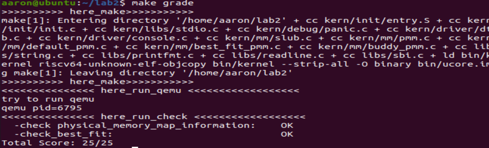
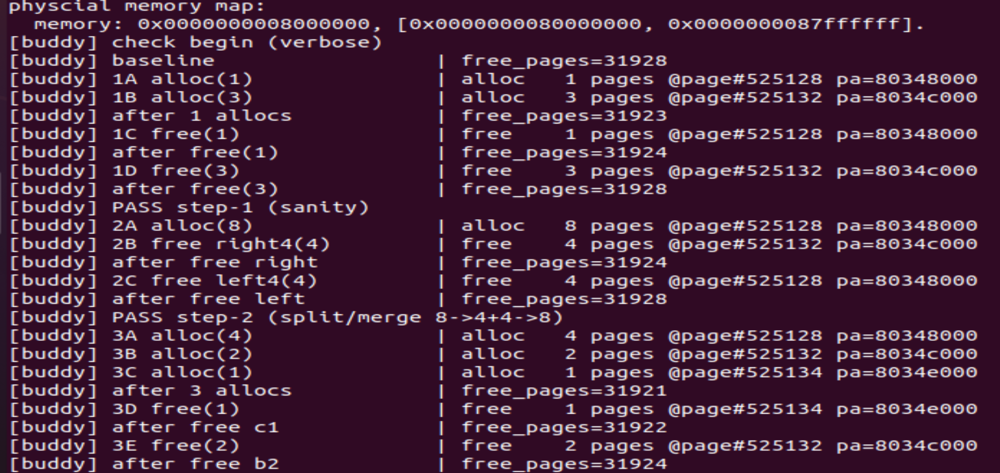
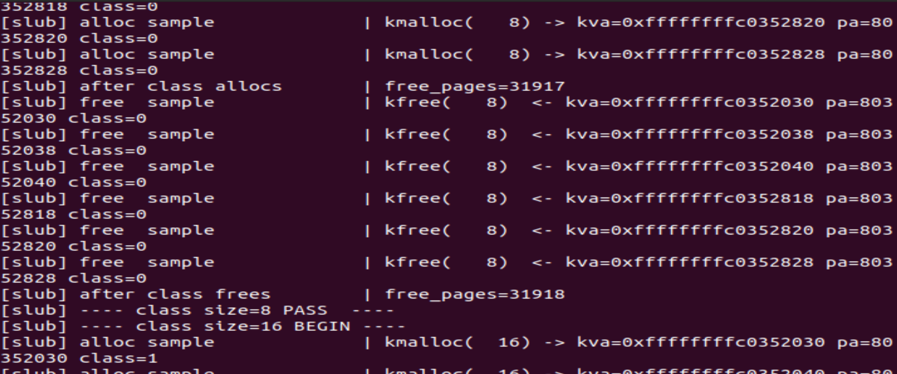
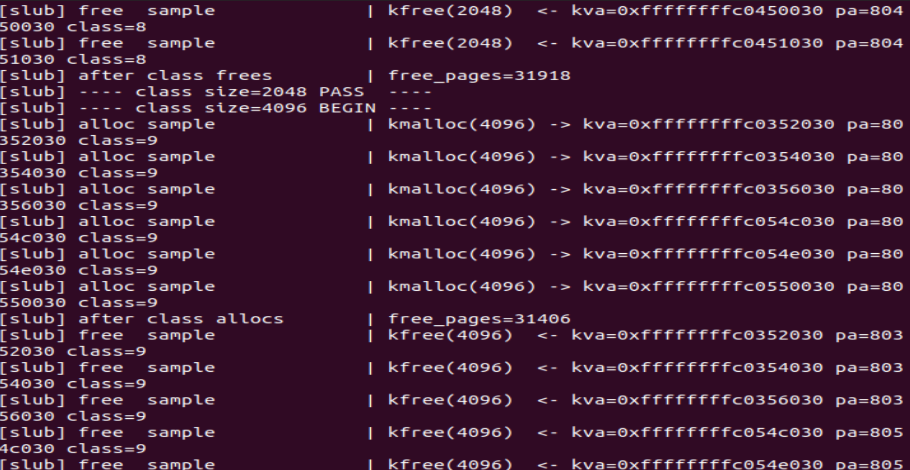

## 操作系统第二次实验报告


## 小组成员：姚智博 王雨莹 王云琪


## 练习1：理解first-fit 连续物理内存分配算法

first-fit 连续物理内存分配算法作为物理内存分配一个很基础的方法，需要同学们理解它的实现过程。请大家仔细阅读实验手册的教程并结合`kern/mm/default_pmm.c`中的相关代码，认真分析default_init，default_init_memmap，default_alloc_pages， default_free_pages等相关函数，并描述程序在进行物理内存分配的过程以及各个函数的作用。 请在实验报告中简要说明你的设计实现过程。请回答如下问题：

- 你的first fit算法是否有进一步的改进空间？

#### default_init

```c
static void default_init(void) {
    list_init(&free_list);
    nr_free = 0;
}
```

- 初始化容器（链表置空、空闲页数清零）。不向链表加入任何页；真正建块在 `init_memmap()` 中完成。

#### default_init_memmap

```c
static void default_init_memmap(struct Page *base, size_t n) {
    assert(n > 0);
    struct Page *p = base;
    for (; p != base + n; p ++) {
        assert(PageReserved(p));
        p->flags = p->property = 0;
        set_page_ref(p, 0);
    }
    base->property = n;
    SetPageProperty(base);
    nr_free += n;
    if (list_empty(&free_list)) {
        list_add(&free_list, &(base->page_link));
    } else {
        list_entry_t* le = &free_list;
        while ((le = list_next(le)) != &free_list) {
            struct Page* page = le2page(le, page_link);
            if (base < page) {
                list_add_before(le, &(base->page_link));
                break;
            } else if (list_next(le) == &free_list) {
                list_add(le, &(base->page_link));
            }
        }
    }
}
```

**功能**：把 `[base, base+n)` 这一整段页初始化为“一个空闲块”，并按物理地址顺序插入到 `free_list` 中。

1. `assert(n > 0);`
   要求至少有一页。
2. `for (; p != base + n; p++) { ... }`
   对这段内的每一页：
   - `assert(PageReserved(p));`：保证之前 `page_init()` 把所有 `Page` 置为“保留”；此处将它们从“保留”转入“可管理”的空闲状态。
   - `p->flags = p->property = 0;`：清标志、清长度；只有块头才会重新设置 `property`。
   - `set_page_ref(p, 0);`：引用计数清零（空闲页没有被映射/占用）。
3. `base->property = n; SetPageProperty(base);`
   把块头标记为“空闲块头”，并记录块长= n。
4. `nr_free += n;`
   空闲页总数+ n。
5. 把这个空闲块插入到 `free_list` 中，且保持链表按物理地址升序：
   - 如果链表空，直接 `list_add(&free_list, &base->page_link)`。
   - 否则遍历链表，找到第一个 `page` 的物理地址大于 `base` 的位置，在它之前插入；若遍历到末尾都没找到比它大的，插到表尾。

**作用**：把“可管理的空闲物理区间”注册到分配器的链表中，后续分配/释放都以“块头”为粒度维护。

#### default_alloc_pages

```c
static struct Page * default_alloc_pages(size_t n) {
    assert(n > 0);
    if (n > nr_free) return NULL;

    struct Page *page = NULL;
    list_entry_t *le = &free_list;
    while ((le = list_next(le)) != &free_list) {
        struct Page *p = le2page(le, page_link);
        if (p->property >= n) { // First-Fit：遇到第一个够大的块
            page = p;
            break;
        }
    }
    if (page != NULL) {
        list_entry_t* prev = list_prev(&(page->page_link));
        list_del(&(page->page_link)); // 先把这块摘下

        if (page->property > n) { // 需要拆分
            struct Page *p = page + n;     // 剩余块的新头
            p->property = page->property - n;
            SetPageProperty(p);
            list_add(prev, &(p->page_link)); // 插回原位置（保持顺序）
        }
        nr_free -= n;
        ClearPageProperty(page); // 分配出去的这段不再是“空闲块头”
    }
    return page; // 返回被分配块的“原头页指针”，代表 [page, page+n)
}
```

**策略**：**First-Fit**（首次适配）。从链表头开始找第一个 `property >= n` 的空闲块：

- **足够大**：
  - 若 `== n`：整块取走，直接从链表删除，不留残块。
  - 若 `> n`：**拆分**：以 `page+n` 作为“剩余空闲块”的新头，长度 `old_len - n`，重新标记并插回原位置（`prev` 后），保证链表升序不变。
- `nr_free -= n`：空闲页总数减少。
- `ClearPageProperty(page)`：被分配出去的这段现在是“已占用”，不再当作空闲块头。

**时间复杂度**：

- 遍历查找：O(**K**)（K 为空闲块数）；
- 删除/插入链表：O(1)；
- 总体：**O(K)**。

#### default_free_pages

```c
static void default_free_pages(struct Page *base, size_t n) {
    assert(n > 0);
    struct Page *p = base;
    for (; p != base + n; p ++) {
        assert(!PageReserved(p) && !PageProperty(p));
        p->flags = 0;
        set_page_ref(p, 0);
    }
    base->property = n;
    SetPageProperty(base);
    nr_free += n;

    // 先把 [base, base+n) 作为一个空闲块插回链表（按地址有序）
    if (list_empty(&free_list)) {
        list_add(&free_list, &(base->page_link));
    } else {
        list_entry_t* le = &free_list;
        while ((le = list_next(le)) != &free_list) {
            struct Page* page = le2page(le, page_link);
            if (base < page) {
                list_add_before(le, &(base->page_link));
                break;
            } else if (list_next(le) == &free_list) {
                list_add(le, &(base->page_link));
            }
        }
    }

    // 尝试与“前一块”合并
    list_entry_t* le = list_prev(&(base->page_link));
    if (le != &free_list) {
        p = le2page(le, page_link); // p是前一块的头页
        if (p + p->property == base) { // 前块尾紧邻本块头
            p->property += base->property; // 前块扩展
            ClearPageProperty(base);
            list_del(&(base->page_link)); // 本块从链表移除
            base = p; // 合并后的新块头变为p
        }
    }

    // 尝试与“后一块”合并
    le = list_next(&(base->page_link));
    if (le != &free_list) {
        p = le2page(le, page_link); // p是后一块头页
        if (base + base->property == p) { // 本块尾紧邻后块头
            base->property += p->property; // 本块扩展
            ClearPageProperty(p);
            list_del(&(p->page_link)); // 后块从链表移除
        }
    }
}
```

1. 逐页清理（`flags=0`、`ref=0`），并断言“释放来的页不是保留页且不是某个空闲块头”。
2. 把 `[base, base+n)` 先当作一个新的空闲块按物理地址有序插回链表，并 `nr_free += n`。
3. 相邻合并：
   - 往前看一块：如果“前块的尾 == 本块的头”，说明它俩相邻，合并为更大的“前块”，并把“本块”从链表删掉；更新 `base = 前块头`。
   - 再往后看一块：如果“本块的尾 == 后块的头”，同理与后块合并，删除后块节点，扩展本块长度。

**时间复杂度**：

- 插入时最坏要遍历链表找插入点：O(K)；
- 合并检查是 O(1)。
- 总体：**O(K)**。

**作用**：保障链表尽量大块化、减少外部碎片；地址有序是合并的前提。

#### default_pmm_manager

```
const struct pmm_manager default_pmm_manager = {
    .name = "default_pmm_manager",
    .init = default_init,
    .init_memmap = default_init_memmap,
    .alloc_pages = default_alloc_pages,
    .free_pages = default_free_pages,
    .nr_free_pages = default_nr_free_pages,
    .check = default_check,
};
```

- “多态”的关键：框架层只认 `pmm_manager` 这张“虚表”，把实际工作派发给对应实现（这里是 First-Fit）。
  - `.name = "default_pmm_manager"`：记录管理器名称，用于调试输出
  - `.init = default_init`：初始化物理内存管理器自身的数据结构。
  - `.init_memmap = default_init_memmap`：在探测完物理内存后，由 `page_init()` 调用，把一整段内存“挂入”空闲列表。
  - `.alloc_pages = default_alloc_pages`：物理页分配函数。根据算法（First-Fit），从空闲链表中找到第一个满足 `property ≥ n` 的块，分割出所需页并返回指针。
  - `.free_pages = default_free_pages`：释放页块函数。把 `[base, base+n)` 插回空闲链表（保持地址顺序），并尝试与相邻块合并，更新空闲总数。
  - `.nr_free_pages = default_nr_free_pages`：返回当前空闲页总数（`nr_free`）。
  - `.check = default_check`：自检函数，用于测试该管理器是否正确工作。

### 简要实现过程

> 采用 `default_pmm_manager` 实现 first-fit：
> (1) 在 `default_init()` 初始化空闲链表与计数；
> (2) `default_init_memmap()` 将可用物理区间整理成**以块头标记**的空闲块，按**物理地址有序**挂入链表并累计 `nr_free`；
> (3) `default_alloc_pages(n)` 自链首线性查找首个 `property ≥ n` 的块，必要时**就地拆分**残块并维护 `nr_free` 与 `PG_property`；
> (4) `default_free_pages(base,n)` 以地址有序插回，再做**前后相邻合并**，维持大块化与链表有序/一致性。
> 实现过程中，严格维护三类不变量（链表有序、块头唯一、`nr_free` 等式），并在分配/释放路径上设置断言，保证逻辑正确与可调试性。

```sql
┌────────────────────────────┐
│        kern_init()         │
│ （系统初始化入口）            │
└────────────┬───────────────┘
             │
             ▼
┌────────────────────────────┐
│        pmm_init()          │
│ 初始化物理内存管理系统         │
└────────────┬───────────────┘
             │
             ▼
     ┌────────────────────────────────────┐
     │ init_pmm_manager()                 │
     │ 选择默认管理器：                      │ 
     │ pmm_manager = &default_pmm_manager │
     └────────────┬───────────────────────┘
                  │
                  ▼
          pmm_manager->init()
          （→ default_init）
          └─ 初始化空闲链表与计数器
                  │
                  ▼
┌────────────────────────────────────┐
│             page_init()            │
│ 探测物理内存范围 + 计算可用页数量       │
└────────────┬───────────────────────┘
             │
             ▼
   pmm_manager->init_memmap(base, n)
   （→ default_init_memmap）
   └─ 把 [base, base+n) 这段页挂入空闲链表
             │
             ▼
┌───────────────────────────┐
│ 运行阶段：alloc/free 调用   │
└────────────┬──────────────┘
             │
             ├──► pmm_manager->alloc_pages(n)
             │       （→ default_alloc_pages）
             │       └─ First-Fit 分配算法
             │
             ├──► pmm_manager->free_pages(base, n)
             │       （→ default_free_pages）
             │       └─ 插回空闲链表并合并相邻块
             │
             ├──► pmm_manager->nr_free_pages()
             │       （→ default_nr_free_pages）
             │       └─ 返回当前空闲页总数
             │
             └──► pmm_manager->check()
                     （→ default_check）
                     └─ 自检分配与释放正确性

```

### 改进

1. **Next-Fit**：First-Fit 每次都从表头找，长链上频繁小分配会 O(K) 遍历；Next-Fit 用“上次命中处”为起点，均摊更好。
   **做法**：加一个静态游标 `cursor`，每次从 `cursor` 往后扫一圈（环形）。
2. **Best-Fit / Worst-Fit**：
   - Best-Fit 降低碎片尺寸但插入/查找成本更高（需要有序按块长维护或二叉堆/平衡树/跳表等）；
   - Worst-Fit 倾向保留大块；适合少量大分配的工作负载。
3. **分级空闲链表（Segregated Free Lists）**：按块长区间分桶（如 1,2,4,8,…），查询接近 O(1)；拆分后的剩余块回对应桶。
4. **延迟或按需合并（Coalescing on Demand）**：释放时仅插入，不立即合并；当分配失败或空闲块过多时再全局合并（批处理减少开销，但需要触发策略）。

## 练习2：实现 Best-Fit 连续物理内存分配算法

在完成练习一后，参考kern/mm/default_pmm.c对First Fit算法的实现，编程实现Best Fit页面分配算法，算法的时空复杂度不做要求，能通过测试即可。 请在实验报告中简要说明你的设计实现过程，阐述代码是如何对物理内存进行分配和释放，并回答如下问题：

- 你的 Best-Fit 算法是否有进一步的改进空间？

本实验在 `default_pmm` 的空闲链表（循环双向链表）框架下，将 First-Fit 改为 **Best-Fit**。核心改动是：在一次遍历中选出“大小最小但仍能满足 n 页需求”的空闲块，而不是遇到第一个就分配。

具体实现如下：

1. 通过循环遍历 `free_list`，比较每个空闲块的 `property`（连续空闲页数）。
2. 若当前块的大小 `>= n` 且 `< min_size`，则记录为新的最优候选。
3. 遍历完成后，从链表中删除该最优块；若其大小大于 `n`，则将剩余部分拆分为一个新的空闲块，并重新插入链表。
4. 最后更新 `nr_free` 并清除该页块的空闲标志。

简而言之，Best-Fit 的不同点在于：

- 遍历全表寻找最小满足条件的块；
- 不提前中断；
- 对剩余空间进行切割再插入，维持链表有序。

```c
/*LAB2 EXERCISE 2: YOUR CODE*/ 
        // 清空当前页框的标志和属性信息，并将页框的引用计数设置为0
        p->flags = 0;
        p->property = 0;
        set_page_ref(p, 0);
```

这段在“把页重新纳入空闲体系之前”做元数据归零：

- `flags = 0`、`property = 0` 保证后续再标记/赋值时不会受旧值影响；
- `set_page_ref(p, 0)` 令该页不被任何对象持有；
- 这样做能确保接下来设置“空闲块头/连续页数”等属性时，状态是干净一致的初始态。

```c
 /*LAB2 EXERCISE 2: YOUR CODE*/ 
            // 编写代码
            // 1、当base < page时，找到第一个大于base的页，将base插入到它前面，并退出循环
            // 2、当list_next(le) == &free_list时，若已经到达链表结尾，将base插入到链表尾部
            if(base<page){
                list_add_before(le,&(base->page_link));
                break;
            }else if (list_next(le) == &free_list) {
                list_add(le, &(base->page_link));
            }
```

- 维护按物理地址递增的循环双向链表不变式；
- 遍历到第一个“起始地址大于 `base`”的空闲块 `page` 时，把 `base` 插入其前面，链表仍有序；
- 若到达表尾仍未找到更大的块，则把 `base` 插在尾部；
- 该顺序对后续相邻合并至关重要（判断是否连续只需看前驱/后继）。

```c
/*LAB2 EXERCISE 2: YOUR CODE*/ 
    // 下面的代码是first-fit的部分代码，请修改下面的代码改为best-fit
    // 遍历空闲链表，查找满足需求的空闲页框
    // 如果找到满足需求的页面，记录该页面以及当前找到的最小连续空闲页框数量

    while ((le = list_next(le)) != &free_list) {
        struct Page *p = le2page(le, page_link);
        if (p->property >= n && p->property < min_size) {
            min_size = p->property;
            page = p; 
        }
```

- **核心策略**：在一次遍历中，用 `min_size` 维护当前“最小可用块”的大小；
- 每遇到 `p->property >= n` 的块，若其大小更小（更贴近 `n`），就更新 `page` 与 `min_size`；
- **不提前 `break`，确保拿到全局最优候选；**
- 遍历结束后，`page` 即最优块，随后进行摘链+必要切割并更新 `nr_free`/标志。

```c
/*LAB2 EXERCISE 2: YOUR CODE*/ 
    // 编写代码
    // 具体来说就是设置当前页块的属性为释放的页块数、并将当前页块标记为已分配状态、最后增加nr_free的值
    base->property = n;
    SetPageProperty(base);
    nr_free = nr_free + n;
```

- 这段是释放过程里的关键一步；
- 将 `base` 的 `property` 置为本次释放的连续页数 `n`，并用 `SetPageProperty(base)` 把它标记成空闲块头；
- `nr_free += n` 维护系统空闲页总数，用于快速判断能否满足后续请求；
- 接下来再做****有序插入 + 相邻合并****，把碎片降到最小。

```c
 /*LAB2 EXERCISE 2: YOUR CODE*/ 
        // 编写代码
        // 1、判断前面的空闲页块是否与当前页块是连续的，如果是连续的，则将当前页块合并到前面的空闲页块中
        // 2、首先更新前一个空闲页块的大小，加上当前页块的大小
        // 3、清除当前页块的属性标记，表示不再是空闲页块
        // 4、从链表中删除当前页块
        // 5、将指针指向前一个空闲页块，以便继续检查合并后的连续空闲页块
        if (p + p->property == base) {
            p->property += base->property;
            ClearPageProperty(base);
            list_del(&(base->page_link));
            base = p;
        }
```

- 通过指针运算 `p + p->property == base` 判断前块 `p` 与当前块 `base` 是否物理相邻；
- 若相邻：把 `base` 的页数并入 `p`，`base` 就不再是块头，需 `ClearPageProperty(base)` 并从链表删除其节点；
- 把 `base` 指针回退到合并后的新块头 `p`，便于继续尝试与后继合并
- 该步骤能显著缓解外部碎片。

测试结果如图：




### 物理内存的分配与释放过程

- **分配阶段：**
   当需要 `n` 页时，算法遍历整个空闲链表，从中选出大小最接近 `n` 的空闲块。若块大于 `n`，则拆分出前 `n` 页作为分配部分，其余部分重新插入空闲链表。
   分配完成后，更新全局空闲页计数 `nr_free -= n` 并清除块头属性。
- **释放阶段：**
   当释放 `n` 页时，系统首先将这些页重新设置为空闲块（`SetPageProperty(base)`），并插入到空闲链表中。
   然后检查与前后相邻块是否物理连续（`p + p->property == base`），若相邻则进行合并，更新块的 `property` 并删除多余节点，防止产生外部碎片。

### 改进空间

1. **查找效率优化：**
    当前实现的遍历是线性查找（O(m)）。若使用按大小组织的平衡树（红黑树/最小堆）或分离空闲链表，可将查找复杂度降至 O(log m) 或 O(1)。
2. **双向合并机制：**
    现代码仅对“前块”进行合并，可进一步扩展为同时检测前后两个相邻块，实现更彻底的碎片回收。
3. **延迟合并与整理：**
    可采用延迟合并策略，避免在频繁释放时多次操作链表；或定期整理，保持空闲空间的连续性。
4. **伙伴系统（Buddy System）：**
    若进一步改进，可以采用伙伴系统管理方式，使得分配与回收的复杂度降至对数级，并天然支持合并。


## 扩展练习Challenge1：buddy system（伙伴系统）分配算法

Buddy System算法把系统中的可用存储空间划分为存储块(Block)来进行管理, 每个存储块的大小必须是2的n次幂(Pow(2, n)), 即1, 2, 4, 8, 16, 32, 64, 128...

- 参考[伙伴分配器的一个极简实现](http://coolshell.cn/articles/10427.html)， 在ucore中实现buddy system分配算法，要求有比较充分的测试用例说明实现的正确性，需要有设计文档。


## 测试结果如图所示：



我们可以看到分配后和释放后的页数变化与实际操作完全相符合！


### 一. 总体设计

#### 1. 抽象与不变量

- **阶**：块大小为 `2^order` 页，`order ∈ [0 .. max_order]`。
- **页号：`idx = (page - pages) + nbase`，仅按页为粒度（不是字节）。
- **伙伴计算**：给定块头页号 `idx` 与阶 `k`，伙伴块头：
   `buddy_idx = idx XOR (1 << k)`。
- **块头识别**：空闲块只在链表中挂**块头**那一页的 `struct Page`，
   用 `PageProperty(head)=1` 表示“这是空闲块头”，并约定 `head->property = order`（在本实现中 `property` 字段承载“阶”）。

**不变量**：

1. 每个阶的空闲链 **只保存** 满足 2^k 对齐的**块头**。
2. 已分配的块头 `PageProperty == 0`；空闲块头 `PageProperty == 1` 且 `property == order`。
3. 相同阶的伙伴块释放后**必然可合并**为更高一阶，直到无法再合并。
4. 全局空闲页计数 `buddy_total_free_pages` 与链表内容一致，分配/释放时保持守恒。

#### 2. 数据结构

位于 `kern/mm/buddy_pmm.c`：

```
typedef struct {
    list_entry_t free_list; // 该阶的空闲块链表（循环双向链）
    unsigned int nr_free;   // 该阶空闲“块”数量（不是页数）
} free_area_buddy_t;

static free_area_buddy_t *buddy_area; // [0..max_order]
static int max_order;
static size_t buddy_total_free_pages; // 系统空闲页总数
```

- **多阶桶数组** `buddy_area[0..max_order]`：每阶一个空闲链表。
- **每个链表元素**：仅“块头页”的 `struct Page`，通过 `page_link` 链入。


### 二. 关键算法

#### 1. 初始化 `.init` & `.init_memmap`

- `.init()`：清空各阶链表与计数器；`max_order` 暂置 0。
- `.init_memmap(base, n)`：
  1. 依据 **全机物理页数** 上限推算 `max_order`（`floor(log2(total_pages))`，封顶 31）。
  2. 清空 `[base, base+n)` 的 `Page` 元数据（flags/ref）。
  3. 将 `[base, base+n)` **按“最大可用、且对齐”的阶**切分为若干块，并将每个块头挂入对应阶的空闲链表。
      具体对齐选择函数：`max_order_fit(cur, remain) -> k`，满足 `2^k <= remain && idx(cur) % 2^k == 0`，自高到低选最大 `k`。
  4. 更新 `buddy_total_free_pages += n`。

**设计动机**：初始内存可能不是从 2^max_order 对齐位置开始，所以需要“**最大且对齐**”地切块，确保后续伙伴定位成立。

#### 2.分配 `alloc_pages(n)`

1. 对 `n` 向上取整到 `2^need_k`：`need_k = ceil_log2_pages(n)`。
2. 自 `need_k` 阶向**更大阶**查找第一个非空阶 `j`：
   - 如果没找到（`j > max_order`），返回 `NULL`。
3. 从 `j` 阶取一个块（块头 `blk` ），然后**逐级二分**下放至 `need_k`：
   - 每下降一级，把“右半块”挂回更低一阶的空闲链（它是新的空闲块头）。
4. 返回 `blk`，并 `buddy_total_free_pages -= 2^need_k`，清掉 `PageProperty(blk)`。

**复杂度**：查找 O(number of orders)，拆分 O(order gap)。
 **对齐保证**：块头在二分拆分过程中始终保持 2^k 对齐（以块头作为“左半部分”的起点）。

#### 3. 释放 `.free_pages(base, n)`

1. 计算 `order = ceil_log2_pages(n)`，并取块头页号 `idx`。
2. 自当前 `order` 开始，循环查找**伙伴块**：
   - `buddy_idx = idx ^ (1 << order)`，对应伙伴块头 `bud = idx_page(buddy_idx)`。
   - 若 `bud` 是同阶空闲块头（`PageProperty(bud)==1 && bud->property==order`）且**确实**在该阶空闲链中，则将其从链表摘除，并**合并**（新块头取较小地址），阶数 `order++` 继续向上尝试。
   - 否则停止合并。
3. 将最终块头 `cur` 挂回当前 `order` 阶。
4. `buddy_total_free_pages += 2^ceil_log2(n)`。

**要点**：

- 我们通过线性扫描在该阶空闲链中确认伙伴确实存在于链上，避免“误合并”。
- 释放时按向上取整对齐（如果上层记录有原始阶，亦可直接使用原始阶）。

### 三. 与 ucore 框架的衔接

#### 1. 接口实例

在 `buddy_pmm.c` 末尾导出管理器：

```
const struct pmm_manager buddy_pmm_manager = {
    .name = "buddy_pmm_manager",
    .init = buddy_init,
    .init_memmap = buddy_init_memmap,
    .alloc_pages = buddy_alloc_pages,
    .free_pages  = buddy_free_pages,
    .nr_free_pages = buddy_nr_free_pages,
    .check = buddy_check,
};
```

#### 2.选择启用

在 `kern/mm/pmm.c` 的 `init_pmm_manager()` 中设为：

```
pmm_manager = &buddy_pmm_manager;
```

### 四. 测试方案与用例

#### 1. 自测总览

自测函数 `buddy_check()`（已在文件中实现并由 `pmm_init()` 在 `check_alloc_page()` 调用）覆盖以下场景，并打印：

```
[buddy] check begin
[buddy] check OK, free=XXXX pages
```

#### 2.用例设计

1. **基本分配/释放**（sanity + 非 2 幂向上取整）
   - `alloc_pages(1)`、`alloc_pages(3)`，检查 3 页请求返回的块头对齐为 4 页；释放后二次守恒。
2. **对偶合并路径**
   - `alloc_pages(8)` 返回 8 页块，切分成 4+4 分别释放，检查能合回 8 页（释放前后 `nr_free_pages` 不变）。
3. **跨阶混合**
   - 分配 `4/2/1` 页三种，乱序释放，要求总量守恒。
4. **边界请求**
   - 请求过大（超过当前空闲总页数+1）必须失败；守恒不变。
5. **非 2 幂规模从 1..17 的对齐验证**
   - 对每次 `alloc_pages(req)`，用 `ceil_log2_pages(req)` 验证块对齐。
6. **随机压力（确定性）**
   - 在有界 live 集合上执行 N=512 轮随机 alloc/free，覆盖各种合并/拆分路径，最后全部释放，检查守恒。

#### 3.验证方法与输出

- 运行：`make qemu`

- 关键输出（示例）：

  ```
  memory management: buddy_pmm_manager
  [buddy] check begin
  [buddy] check OK, free=31929 pages
  ```

- 判定标准：

  - 没有 `assert` 触发；
  - `[buddy] check OK` 打印，且最终 `free` 页数与进入测试前一致（守恒）。


### 五. 关键代码片段（摘录）

- **buddy_idx 计算与对齐检查**

```
static inline int ceil_log2_pages(size_t n) { ... } // 2^k >= n

static inline void check_block_alignment(struct Page *p, int order) {
    size_t idx  = (size_t)(p - pages) + nbase;
    size_t mask = ((size_t)1 << order) - 1;
    assert((idx & mask) == 0);
}
```

- **最大全局对齐切块（init_memmap）**

```
while (remain) {
    int k = max_order_fit(cur, remain);  // 最大且对齐
    if (k < 0) k = 0;
    buddy_push(k, cur);                  // 以 cur 为块头挂入 k 阶
    cur += (1u << k);
    remain -= (1u << k);
}
```

- **分配：向上找阶 + 二分回填**

```
int j = need_k;
while (j <= max_order && list_empty(&buddy_area[j].free_list)) j++;
if (j > max_order) return NULL;
struct Page *blk = le2page(list_next(&buddy_area[j].free_list), page_link);
buddy_pop(j, blk);
while (j > need_k) {
    j--;
    struct Page *right = blk + (1u << j);
    buddy_push(j, right);                // 右半块回填
}
ClearPageProperty(blk);
buddy_total_free_pages -= (1u << need_k);
return blk;
```

- **释放：伙伴合并**

```
while (order < max_order) {
    size_t buddy_idx = idx ^ (1u << order);
    struct Page *bud = idx_page(buddy_idx);
    int can_merge = 0;
    if (PageProperty(bud) && bud->property == (unsigned)order) {
        // 在线性扫描该阶空闲链确认 bud 存在，再摘除
        ...
        can_merge = 1;
    }
    if (!can_merge) break;
    if (buddy_idx < idx) { cur = bud; idx = buddy_idx; }
    order++;
}
SetPageProperty(cur); cur->property = order;
list_add(&buddy_area[order].free_list, &cur->page_link);
buddy_total_free_pages += (1u << ceil_log2_pages(n));
```


## 扩展练习Challenge2：任意大小的内存单元slub分配算法

slub算法，实现两层架构的高效内存单元分配，第一层是基于页大小的内存分配，第二层是在第一层基础上实现基于任意大小的内存分配。可简化实现，能够体现其主体思想即可。

- 参考[linux的slub分配算法/](https://github.com/torvalds/linux/blob/master/mm/slub.c)，在ucore中实现slub分配算法。要求有比较充分的测试用例说明实现的正确性，需要有设计文档。


## 测试结果如下：





我们可以看到分配情况没有问题。


### 一. 总体思路

####  两层架构

- **底层（页层）**：直接复用我们已完成的 **buddy_pmm**（`alloc_pages/free_pages`）。
- **上层（对象层）**：本实验的 **SLUB**，在一张/多张页上组织“对象”的快速分配。
  - 常用尺寸类：`8, 16, 32, ..., 4096` 字节
  - 每个尺寸一个 **kmem_cache**，其内部维护 slab 的三条链：`partial/full/empty`


### 二. 数据结构与关键字段

#### 1. `struct slab`

- 物理上一段连续页（`2^order` 页），被切成 N 个等大对象单元。
- 放在 slab 起始处（对齐到 `align`），**自包含**元数据，便于**通过对象地址回推 slab 基址**：
  - `cache`：所属 kmem_cache
  - `order`、`pages`：底层页块信息
  - `inuse/total`：当前在用对象数/总对象数
  - `freelist`：单链表头，每个空闲对象的开头 1 个指针存下一个空闲对象地址
  - `link`：把 slab 串到 `partial/full/empty` 三个链之一

#### 2. `struct kmem_cache`

- 表示一种固定对象大小的“缓存仓”：
  - `obj_size`、`align`、`order`
  - `objs_per_slab`：每 slab 可容纳对象个数
  - 三条链表：`partial`（还有空位）、`full`（已满）、`empty`（已建好但未使用）
  - `inuse_objs`：统计用
  - `ctor`：可选构造回调（简化实现中常为 NULL）

#### 3. 对齐与布局

- `compute_layout()`：
  - `slab_bytes = (1<<order) * PGSIZE`
  - `off = round_up(sizeof(struct slab), align)`
  - `payload = slab_bytes - off`
  - `objs_per_slab = payload / obj_size`（**必须 >0**，否则 assert）
- `slab_build()`：在 slab 管理头后连一条**对象空闲单链表**（freelist）。

### 三. 算法流程

#### 1. cache 创建（`kmem_cache_create`）

- 用 **1 页**作为 kmem_cache 自身（简化实现，足够用），清零后设置 `name/obj_size/align/order/ctor`。
- 调 `compute_layout` 计算 `objs_per_slab`，初始化三条链为空。

#### 2. cache 扩张（`cache_grow`）

- 底层向 buddy 申请 `2^order` 页，`slab_build` 切对象并挂到 **partial**（因为 `inuse=0<total`）。

#### 3. 分配（`kmem_cache_alloc`）

1. 先试 `partial`：若空，看看 `empty` 是否有 slab；再不行就 `cache_grow`。
2. 从 slab 的 `freelist` 弹出一个对象指针，`inuse++`、`inuse_objs++`。
3. 若 `inuse == total`，把该 slab 节点迁到 `full` 链。

#### 4. 释放（`kmem_cache_free`）

1. 通过对象虚拟地址 `obj`，**页粒度对齐**回到 slab 基址：
    `base = kva & ~(slab_bytes - 1)` → `struct slab *s = (struct slab *)base`
    并断言 `s->cache == c`（对象必须还给原 cache）。
2. 头插回 `s->freelist`，`inuse--`、`inuse_objs--`。
3. 若从 full 变回非满（`inuse == total - 1`），把 slab 从 `full` 移回 `partial`。
4. 若 slab 变空（`inuse == 0`），**直接归还底层**：
    从链表删除并 `free_pages(s->pages, 1<<order)`（slab 管理头也在这批页里，不能再访问 `s`）。

#### 5. kmalloc/kfree（通用接口）

- 小于等于 4096 的用合适的 **kmalloc cache**；更大直接走页分配（向上按页对齐），释放时也走页释放。

### 四. 自测方案与覆盖点

#### 1. 用例集

1. **尺寸类批量测试**（每类 256 次 alloc/free）：
   - 覆盖 8B～4096B 所有 kmalloc cache
   - `memset` 写入以检测对象是否可正常读写
2. **跨页临界**：
   - `kmalloc(PGSIZE-32)` 与 `kmalloc(PGSIZE+128)`
   - 覆盖“小于一页”和“需要多页”的两条路径
3. **随机压力**：
   - 1024 轮随机 alloc/free，live 集合上限 256
   - 覆盖 slab grow/回收、partial/full/empty 迁移
4. **守恒检查**：
   - 自测开始读取 `base = nr_free_pages()`，结束读取 `end = nr_free_pages()`，`assert(base == end)`。

#### 2. 运行与输出

- 在 `pmm_init()` 里调用：

  ```
  slub_init();
  slub_check();   
  ```

- `make qemu` 里可以看到：

  ```
  [slub] check begin
  [slub] check OK, free=xxxxx pages
  ```

- 无断言失败、无越界访问。


## 扩展练习Challenge3：硬件的可用物理内存范围的获取方法

- 如果 OS 无法提前知道当前硬件的可用物理内存范围，请问你有何办法让 OS 获取可用物理内存范围？

### 可能的方案：采用手动探测方法

#### 基本思路

通过逐块访问物理内存地址，结合异常捕获机制，直接验证内存的可读写性来确定可用内存边界。

#### 详细实现步骤

1. **异常处理机制建立**

操作系统首先设置专门的内存访问异常处理程序。当访问不存在或受保护的物理地址时，CPU会触发异常（如页面错误、段错误），异常处理程序负责记录异常地址并安全恢复执行。

2. **确定探测起点和范围**

- **安全起始点**：从已知安全的物理地址开始，通常选择1MB（0x100000）处，跳过低地址的系统保留区域
- **探测范围**：根据架构特性设定合理上限，32位系统到4GB，64位系统到更大值
- **探测步长**：采用分层策略，快速扫描用大步长（1MB），精细探测用小步长（4KB）

3.  **安全探测协议**

  对于每个测试地址，执行严格的非破坏性测试：

- 保存原始数据：读取并保存目标地址的当前值
- 模式写入测试：写入特定测试模式
- 立即验证：读取该地址，检查是否与写入值一致
- 数据恢复：无论测试结果如何，都恢复原始数据
- 异常处理：如果触发异常，记录该地址为边界点

4. **分层探测策略**

**第一阶段：快速边界扫描**

- 以1MB步长跳跃测试，快速定位大块内存边界
- 发现可用→不可用转变时记录大致边界

**第二阶段：边界精确定位**

- 在可疑边界区间使用二分查找算法
- 以4KB页面大小为步长，精确定位边界地址
- 确保所有边界都对齐到页面大小

**第三阶段：全面验证**

- 对可用区域进行多种模式测试（全0、全1、交替模式等）
- 验证内存的稳定性和可靠性

5. **内存区域处理**

- **区域合并**：将相邻的可用页面合并为连续内存区域
- **可信度评估**：根据测试通过情况评定内存区域的可信度
- **结果输出**：生成完整的可用物理内存范围地图


#### 方案合理性分析

**物理内存的本质特性决定了探测的可行性**：

- 真正的RAM物理内存具备固有的"可存储、可读取、数据保持"特性，这是其作为存储介质的基本物理属性
- 每个可用的物理内存单元必须能够正确保存写入的数据，并在读取时返回相同内容
- 这一特性与内存的物理实现（DRAM、SRAM等）无关，是所有RAM类型共有的基本行为特征

**问题与解决方案的对应**：

- **核心问题**：OS启动时对物理内存布局"一无所知"
- **解决方案**：利用RAM的固有特性作为发现机制——通过实际验证每个地址是否表现出RAM的典型行为来识别可用内存
- **对应关系**：不知道内存范围 → 通过特征行为识别内存范围


## lab2物理内存管理实验知识点总结

### 一、物理内存管理基础

#### 1.1 物理内存直接访问的问题
- **物理内存本质**：由一系列具有实际地址的存储单元构成，每个内存单元拥有唯一的物理地址
- **直接访问机制**：在简单系统中，程序指令中的内存地址直接被CPU当作物理地址发送到内存总线
- **面临的核心问题**：
  - **地址冲突**：内核和用户程序访问相同物理地址会产生冲突，导致数据被意外修改或破坏
  - **连续性要求**：每个程序都需要获得连续的内存空间才能运行，对内存连续性有苛刻要求
  - **碎片化问题**：即使系统总空闲内存足够，如果空闲内存分散成多个不连续小块，程序仍可能无法运行

#### 1.2 地址翻译机制的引入
- **核心思路**：通过"翻译"机制让用户程序访问的地址和内核访问的相同地址对应不同的物理地址
- **"词典"比喻**：
  - 程序使用的地址需要经过"翻译"才能变成真正的物理地址
  - 每个程序有唯一的"词典"，能使用的内存仅限于其"词典"所包含的范围
  - "词典"存储在内存中，由格式固定的"词条"（页表项）组成

#### 1.3 "页"的概念
- **字节级翻译的缺陷**：为每个字节存储翻译结果至少需要1字节，1MB内存需要1MB"词典"，效率太低
- **页的引入**：
  - 观察到程序使用内存的数量级通常以KB为单位
  - 将连续很多字节合在一起翻译，让它们翻译前后的数值之差相同
  - 大幅减少翻译条目数量，提高效率
- **本实验页大小**：基于RISCV的sv39页表机制，每个页大小为4KB（4096字节）

### 二、物理地址与虚拟地址（sv39机制）

#### 2.1 地址规格参数
- **物理地址**：56位
- **虚拟地址**：39位有效，但占用64位空间
- **虚拟地址有效性规则**：
  - 只有低39位有效
  - 63-39位的值必须等于第38位的值（类比有符号整数）
  - 不满足此条件的虚拟地址不合法，访问会产生异常

#### 2.2 地址结构分析
- **页内偏移**：物理地址和虚拟地址的最后12位都表示页内偏移，即地址在所属页帧中的位置
- **页号部分**：
  - 虚拟地址：除最后12位外，剩余部分为虚拟页号（VPN）
  - 物理地址：除最后12位外，剩余部分为物理页号（PPN）
  - 同一位置的物理地址和虚拟地址的页内偏移相同

#### 2.3 分页机制的优势
- **地址管理灵活性**：程序员只需面对连续的虚拟地址空间，无需关心底层物理内存是否连续
- **避免地址冲突**：不同程序可使用相同虚拟地址，通过页表映射到不同物理地址
- **内存管理便利**：操作系统通过修改页表方便实现内存共享、隔离和换页
- **虚拟页与物理页关系**：虚拟页数目远大于物理页数目，程序运行时只占用部分物理页

### 三、页表项（PTE：Page Table Entry）

#### 3.1 PTE基本结构
- **大小**：每个页表项占据8字节（64位）
- **字段组成**：
  - **第53-10位**：44位物理页号（PPN），表示虚拟页号映射到的物理页号
  - **第9-0位**：10位状态信息，描述映射的状态信息

#### 3.2 状态信息位详细说明
- **RSW（2位）**：留给S Mode的应用程序，可用于拓展功能
- **D（Dirty，1位）**：
  - D=1表示从上次D被清零后，有虚拟地址通过该页表项进行写入
  - 用于标识页面是否被修改
- **A（Accessed，1位）**：
  - A=1表示从上次A被清零后，有虚拟地址通过该页表项进行读、写或取指
  - 用于跟踪页面访问情况
- **G（Global，1位）**：
  - G=1表示该页表项是"全局的"，所有地址空间（所有页表）都包含这一项
  - 常用于内核映射，避免TLB频繁刷新
- **U（User，1位）**：
  - U=1表示用户态程序可通过该页表项进行映射
  - S Mode默认不能通过U=1的页表项映射，需手动设置sstatus的SUM位为1
  - 无论SUM位如何，S Mode都不允许执行U=1页面中的指令（安全考虑）

#### 3.3 权限位（R,W,X）控制
- **R（Readable）**：可读权限
- **W（Writable）**：可写权限  
- **X（Executable）**：可执行权限
- **权限检查机制**：
  - 即使虚拟地址成功映射到物理地址，如果权限不匹配仍会报出异常
  - 例如：W=0表示不可写，store指令通过该页表项映射找到物理地址后仍会报异常
- **权限位组合类型**：根据R,W,X取值的不同组合，定义不同的页面访问权限

### 四、多级页表（sv39三级页表）

#### 4.1 多级页表的必要性
- **单级页表问题**：
  - 虚拟地址空间太大（39位虚拟地址，12位页内偏移，剩余27位虚拟页号）
  - 单级页表需要2²⁷×8B=1GiB内存，大量未使用的虚拟地址对应非法页表项，浪费内存
- **多级页表优势**：采用树状结构，只为实际使用的虚拟地址范围分配页表内存

#### 4.2 sv39三级页表结构
- **虚拟地址划分**：
  - 39位虚拟地址被划分为：
    - 9位"大大页页号"（一级索引）
    - 9位"大页页号"（二级索引，大大页内的页内偏移）
    - 9位"页号"（三级索引，大页的页内偏移）
    - 12位页内偏移
- **页表层级结构**：
  - **根节点（一级页表）**：占据4KB内存，存储512个页表项，对应512个1GiB大大页
  - **二级页表**：占据4KB内存，存储512个页表项，对应512个2MiB大页
  - **三级页表**：占据4KB内存，存储512个页表项，对应512个4KB页
- **设计原理**：4096/8=512，恰好可以在一页中放下512个页表项

#### 4.3 大页映射机制
- **二级页表项映射大页**：将二级页表项的R,W,X设置为不是全0，可直接映射2MiB大页
- **三级页表项映射大大页**：将三级页表项的R,W,X设置为不是全0，可直接映射1GiB大大页
- **控制范围**：
  - 一级页表项控制4KiB虚拟内存
  - 二级页表项控制9位虚拟页号，总计控制4KiB×2⁹=2MiB虚拟内存
  - 三级页表项控制18位虚拟页号，总计控制2MiB×2⁹=1GiB虚拟内存

#### 4.4 虚拟地址空间大小
- 整个Sv39虚拟内存空间：512（大大页）×512（大页）×512（页）×4096B=512GiB

### 五、页表基址（satp寄存器）

#### 5.1 satp寄存器作用
- 存储树状页表根节点的物理地址信息
- 控制CPU的虚实地址映射关系和内存保护行为

#### 5.2 satp寄存器内容
- **物理页号**：存储最高级页表所在的物理页号，而非起始物理地址
- **MODE字段**：
  - 0000：不使用页表，直接使用物理地址（简单嵌入式系统）
  - 1000：sv39页表（本实验使用，虚拟内存空间512GiB）
  - 1001：Sv48页表（与Sv39兼容）
  - 其他编码保留备用
- **ASID**：地址空间标识符，本实验暂未使用

#### 5.3 操作系统使用方式
- 为不同应用建立不同虚实映射的页表
- 通过修改satp寄存器值指向不同的页表
- 实现CPU虚实地址映射关系及内存保护行为的动态修改

### 六、快表（TLB：Translation Lookaside Buffer）

#### 6.1 TLB引入原因
- **冯诺依曼瓶颈**：物理内存访问速度远低于CPU运行速度，一次访问需要几百个时钟周期
- **页表访问开销**：虚拟地址转物理地址需要3次物理内存访问（三级页表），得到物理地址后还需1次访问读取数据，共4次内存访问

#### 6.2 TLB工作原理
- **局部性原理**：
  - 时间局部性：被访问过的地址很可能在不久的将来再次被访问
  - 空间局部性：一个地址被访问，其附近地址很可能在不久的将来被访问
- **TLB功能**：CPU内部缓存，记录近期已完成的虚拟页号到物理页号的映射
- **工作流程**：
  - 需要映射时先查询TLB
  - 如果TLB中存在该映射（命中），直接完成映射
  - 如果TLB中不存在（缺失），再访问多级页表，并更新TLB

### 七、段页式管理的关键问题

建立分页机制需要正确建立三级页表，涉及以下关键问题：

1. **需要建立页映射关系的物理内存空间**：确定哪些物理内存区域需要建立虚拟地址映射
2. **具体的页映射关系**：定义虚拟页与物理页的对应规则和映射方式
3. **页目录表的起始地址设置**：确定一级页表在物理内存中的存储位置
4. **页表的起始地址和空间需求**：确定二级、三级页表的存储位置和所需空间大小
5. **页目录表项的内容设置**：正确设置一级页表项的物理页号、状态位和权限位
6. **页表项的内容设置**：正确设置二级、三级页表项的物理页号、状态位和权限位

#### 八、物理内存分配算法

#### 8.1 连续物理内存分配算法
- **First-Fit算法**：
  - 从空闲内存块起始位置开始查找
  - 分配第一个大小满足要求的空闲块
  - 实现简单，分配速度快
- **Best-Fit算法**：
  - 遍历所有空闲内存块
  - 分配大小与申请量最接近且满足要求的空闲块
  - 减少外部碎片，提高内存利用率

#### 8.2 高级内存分配算法
- **Buddy System（伙伴系统）**：
  - 将内存划分为2的幂次大小的块
  - 分配时分裂大块，释放时合并伙伴块
  - 避免外部碎片，合并操作高效
- **Slub分配算法**：
  - 针对任意大小内存单元的高效分配
  - 通过slab缓存管理相同大小的内存单元
  - 减少分配与释放开销，适用于频繁的小内存申请场景

## 实验知识点与操作系统原理对应关系分析

### 一、物理内存管理基础

#### 1.1 直接内存访问问题 vs 内存管理目标


- **内存管理四大目标**：
  1. **地址隔离**：确保每个进程拥有独立的地址空间，一个进程的错误不会影响其他进程
  2. **内存保护**：通过硬件机制防止进程越权访问内存区域
  3. **内存共享**：允许进程间安全地共享代码和数据
  4. **内存抽象**：为程序提供统一的、连续的内存视图，隐藏物理内存细节

- **地址空间概念**：
  - 逻辑地址空间：程序看到的地址范围
  - 物理地址空间：实际内存硬件的地址范围
  - 地址绑定：将逻辑地址映射到物理地址的过程


#### 1.2 地址翻译机制 vs 地址空间管理


- **地址绑定时机**：
  1. 编译时绑定：在程序编译时确定物理地址
  2. 加载时绑定：在程序加载到内存时确定物理地址  
  3. 运行时绑定：在执行过程中动态进行地址翻译

- **动态重定位**：
  - 基址寄存器：存储进程的起始物理地址
  - 界限寄存器：确保地址在合法范围内
  - 硬件支持：MMU（内存管理单元）负责运行时地址翻译


### 二、分页机制与虚拟内存

#### 2.1 页的概念 vs 分页存储管理系统


- **分页的基本概念**：
  - 页：进程地址空间的固定长度块
  - 页框：物理内存的固定长度块
  - 页表：存储页到页框映射关系的数据结构

- **分页系统的特点**：
  - 无外部碎片：任何空闲页框都可以分配给需要的页
  - 有内部碎片：进程最后一页可能未被完全利用
  - 页面大小权衡：小页面减少内部碎片但增加页表大小

- **分页的硬件支持**：
  - 页表基址寄存器（PTBR）
  - 转换检测缓冲区（TLB）
  - 有效-无效位保护机制

**对应关系**：原理描述抽象的分页模型，实验提供RISC-V架构的具体实现约束

#### 2.2 sv39地址机制 vs 虚拟内存实现技术


- **虚拟内存核心思想**：
  - 程序不需要全部装入内存即可运行
  - 实现内存的逻辑扩展，提供比物理内存更大的地址空间
  - 基于局部性原理，只将需要的部分装入内存

- **虚拟地址空间结构**：
  - 线性地址空间：一维的地址序列
  - 分页地址空间：由固定大小的页组成
  - 地址翻译：通过页表将虚拟地址映射到物理地址

- **虚拟内存的优势**：
  - 进程隔离：每个进程有独立的地址空间
  - 简化编程：程序员无需关心物理内存布局
  - 内存共享：多个进程可以共享相同的代码或数据

**对应关系**：原理描述通用的虚拟内存概念，实验展示RISC-V sv39的具体规格;原理讨论各种地址空间组织方式，实验采用39位虚拟地址的特定设计


### 三、页表管理与内存保护

#### 3.1 页表项结构 vs 内存保护机制


- **内存保护层次**：
  1. 进程间保护：防止进程相互干扰
  2. 进程内保护：保护操作系统免受用户进程影响
  3. 数据保护：保护数据免受未授权访问

- **保护机制类型**：
  - 访问权限控制：读、写、执行权限分离
  - 特权级保护：用户态和内核态的权限区分
  - 类型安全：确保指令和数据分离

- **保护域概念**：
  - 访问控制矩阵：定义主体对客体的访问权限
  - 能力表：每个进程拥有访问能力列表
  - 保护域切换：通过门机制进行安全域切换

**对应关系**：原理中的保护概念在实验中通过页表项的R/W/X位具体实现


#### 3.2 页表项状态位 vs 页面置换支持


- **页面置换算法基础**：
  - 缺页率：衡量页面置换算法效果的指标
  - 工作集模型：描述进程在一段时间内访问的页面集合
  - 局部性原理：时间局部性和空间局部性

- **经典置换算法**：
  - 最优置换（OPT）：理论最优，无法实际实现
  - 先进先出（FIFO）：简单但可能产生Belady异常
  - 最近最少使用（LRU）：基于访问历史，效果好但实现复杂
  - 时钟算法（Clock）：LRU的近似实现，平衡效果和开销

- **硬件支持需求**：
  - 引用位：标识页面是否被访问
  - 修改位：标识页面是否被修改
  - 访问时间：记录页面最近访问时间

### 四、多级页表与地址翻译

#### 4.1 多级页表 vs 页表组织结构


- **页表设计的挑战**：
  - 空间开销：页表本身占用内存空间
  - 访问效率：地址翻译需要内存访问
  - 稀疏性问题：进程地址空间通常稀疏使用

- **多级页表优势**：
  - 减少内存占用：只为使用的地址范围分配页表
  - 自然支持稀疏地址空间
  - 便于实现内存保护域

- **页表结构变体**：
  - 层次页表：多级索引结构
  - 哈希页表：通过哈希加速查找
  - 倒排页表：物理页框到虚拟页的映射

**对应关系**：原理讨论多级页表的一般概念，实验提供sv39三级页表的具体实例;实验的大页映射机制展示了原理中减少TLB缺失的实际技术

#### 4.2 页表遍历 vs 地址翻译过程


- **地址翻译硬件**：
  - MMU组成：TLB、页表遍历逻辑、保护检查单元
  - 翻译过程：虚拟地址→TLB查找→页表遍历→物理地址
  - 异常处理：缺页异常、保护违例异常

- **翻译过程优化**：
  - TLB设计：全相联、组相联、直接映射
  - 预取策略：基于访问模式的TLB预取
  - 并行查找：同时进行TLB和缓存访问

- **性能影响因素**：
  - TLB命中率：直接影响翻译性能
  - 页表级数：每增加一级增加一次内存访问
  - 页面大小：大页面提高TLB覆盖率


### 五、TLB与缓存优化

#### 5.1 TLB机制 vs 地址翻译缓存


- **缓存层次结构**：
  - L1/L2/L3缓存：数据缓存层次
  - TLB：专门缓存地址翻译结果
  - 页表缓存：缓存页表项的专用缓存

- **TLB管理策略**：
  - 替换算法：LRU、随机、FIFO
  - 一致性维护：上下文切换时的TLB刷新
  - ASID支持：通过地址空间标识符避免频繁刷新

- **TLB性能指标**：
  - 命中率：TLB命中的访问比例
  - 缺失代价：TLB缺失导致的额外延迟
  - 覆盖范围：TLB能缓存的地址空间大小

**对应关系**：实验基于局部性原理设计TLB，验证了原理中的理论基础

### 六、内存分配算法

#### 6.1 连续分配算法 vs 动态存储分配


- **动态存储分配问题**：
  - 请求序列：内存分配和释放的操作序列
  - 碎片问题：外部碎片和内部碎片
  - 分配策略：选择合适内存块的方法

- **经典分配算法理论分析**：
  - **First-Fit**：
    - 时间复杂度：O(n)
    - 空间效率：倾向于产生低地址碎片
    - 适用场景：分配请求大小分布均匀
  
  - **Best-Fit**：
    - 时间复杂度：O(n)或O(log n)（优化后）
    - 空间效率：产生大量小碎片
    - 适用场景：请求大小变化较大
    
  - **Worst-Fit**：
    - 设计思想：选择最大的空闲块
    - 效果：减少小碎片但可能缺乏大块
    - 实际应用：较少使用

**对应关系**：
- **算法实现**：实验实现原理中描述的经典分配算法
- **性能验证**：实验环境可以验证原理中的算法性能分析
- **实际约束**：实验反映真实系统中分配算法的实际效果和限制

#### 6.2 伙伴系统 vs 非连续分配高级算法


- **伙伴系统理论基础**：
  - 块大小：限制为2的幂次
  - 伙伴定义：地址满足特定关系的两个块
  - 分裂与合并：分配时分裂，释放时合并

- **伙伴系统的数学性质**：
  - 地址计算：buddy_addr = block_addr ^ (1 << k)
  - 内存利用率：最坏情况下50%的内部碎片
  - 时间复杂度：分配和释放均为O(log N)

- **伙伴系统变体**：
  - 二进制伙伴系统：经典实现
  - 斐波那契伙伴系统：使用斐波那契数列作为块大小
  - 加权伙伴系统：支持更多块大小选择

**对应关系**：
- **理论实践**：实验实现原理中描述的伙伴系统核心思想
- **约束体现**：实验反映伙伴系统内部碎片问题的实际影响
- **适用场景**：实验展示伙伴系统在页帧分配中的实际价值

## 操作系统原理重要但实验未覆盖的知识点

### 一、虚拟内存高级管理

**页面置换算法的完整实现与优化**

- Belady异常现象的理论分析与实际影响
- LRU算法的精确实现（计数器法、栈算法）
- 工作集模型的实际应用与参数调优
- 置换算法的性能评估与动态适应

**换页机制与存储层次集成**
- 页面文件系统的设计与磁盘调度结合
- 集群换出策略与I/O优化
- 预取机制的实现与 aggressiveness 控制
- 换页开销的量化分析与平衡策略

### 二、内存系统特性

**碎片整理与内存压缩**
- 外部碎片的数学建模与动态监测
- 在线内存压缩算法与时机选择
- 进程移动技术与地址重定位处理
- 压缩开销收益分析与决策机制

**多处理器内存一致性**
- 缓存一致性协议（MESI、MOESI）详细实现
- 基于目录协议与监听协议的对比
- 内存一致性模型（顺序一致性、弱一致性）
- 原子操作的内存语义与实现

### 三、高级架构支持

**NUMA架构内存管理**
- 节点感知的内存分配策略
- 进程调度与内存位置的协同优化
- 跨节点访问开销建模与避免
- 内存迁移的动态决策机制

**硬件虚拟化支持**
- 影子页表技术与性能优化
- 扩展页表（EPT）的硬件实现
- IOMMU与设备直接分配
- 虚拟化开销的量化与分析

### 四、安全与保护机制

**地址空间布局随机化（ASLR）**
- 随机化粒度选择与安全强度
- 性能与安全的量化权衡
- 动态重新随机化机制
- 防护绕过技术与对抗措施


